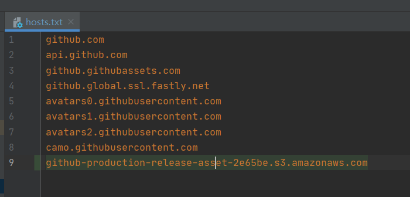
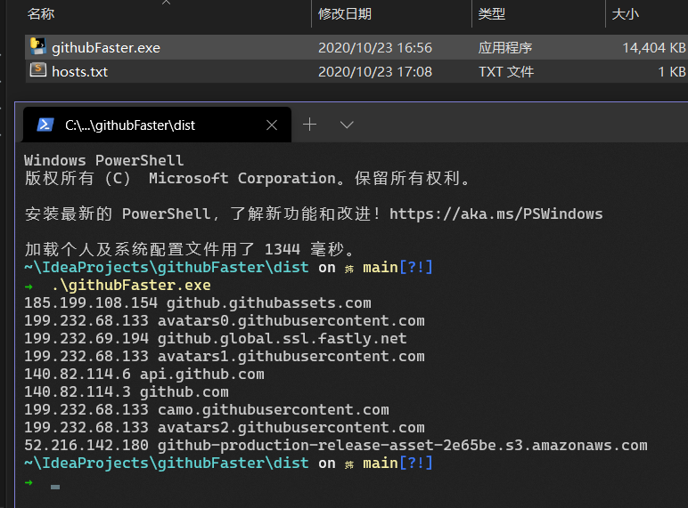

# githubFaster

>修改 Host 文件

国内域名解析的速度太慢，需要通过一些网站如 https://www.ipaddress.com/ 解析得到 IP。然后在主机中配置域名映射，跳过国内 DNS 解析的python的实现

>使用

hosts.txt 和执行文件exe(win)在同一目录

>打包

pyinstaller -F start.py -p venv\Lib\site-packages

>开发计划

